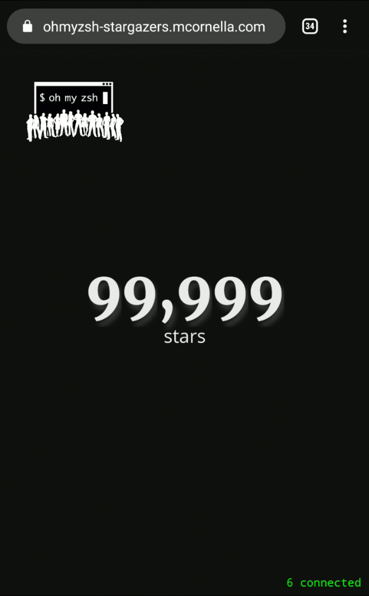

# Oh My Zsh stargazers website

This project was built to follow the number of stars of the Oh My Zsh GitHub repository as it neared 100k.
It is now archived but the celebration can still be watched by going to the GitHub Pages version of the site.

Here's what it looked like when we reached 100k stars:

# Technical details

- A Node.JS server that provided:
  - A webhook to receive `star` events from the repository.
  - A websocket endpoint to send `star` events and a count of users connected to the website.
- A lean frontend built with built-in WebSockets and the following dependencies:
  - [Odometer, by HubSpot](https://github.com/HubSpot/odometer).
  - [confetti.js, by MathuSum Mut](https://github.com/mathusummut/confetti.js/).

# LICENSE

This project is licensed under the [MIT License](./LICENSE.txt)
